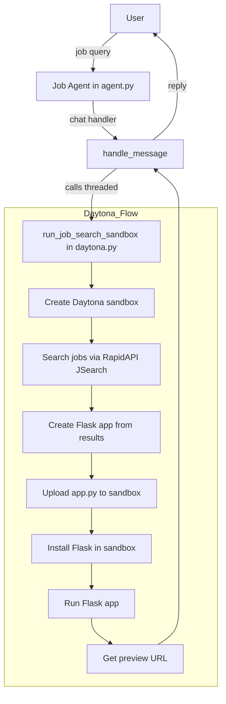
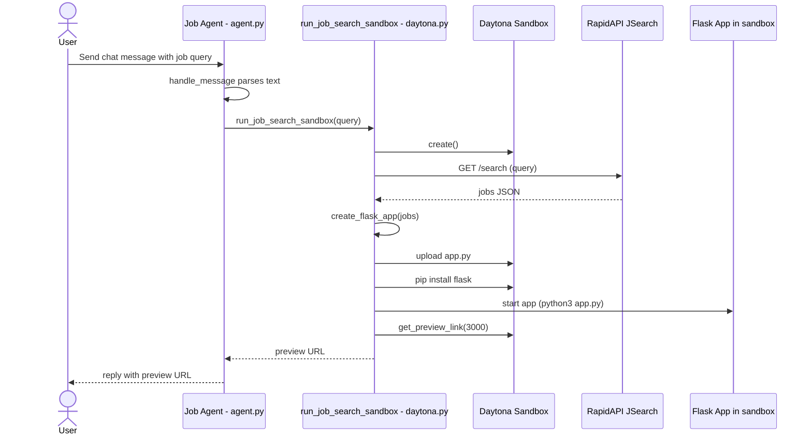

# Job Search Sandbox (Daytona + Flask + uAgents)

A small system that:
- Parses a natural-language job query
- Searches jobs via RapidAPI JSearch
- Spins up a Daytona sandbox and deploys a minimal Flask web preview of results
- Optionally exposes this flow through a uAgents chat agent

## Project Structure
- `daytona.py`: Core logic. Searches jobs, generates a Flask app from results, deploys/runs it inside a Daytona sandbox, and returns a preview URL.
- `agent.py`: uAgents chat agent. Receives a chat message (your job query), calls `run_job_search_sandbox` from `daytona.py`, and replies with the preview URL.

## Prerequisites
- Python 3.10+
- Daytona API key
- RapidAPI JSearch API key

## Environment Variables
Create a `.env` file in the project root with:

```ini
DAYTONA_API_KEY=your_daytona_api_key
JSEARCH_API_KEY=your_rapidapi_key
# Optional / currently unused in code path, kept for future use
ASI_ONE_API_KEY=your_asi_api_key
```

## Install Dependencies
```bash
python3 -m venv .venv
source .venv/bin/activate
pip install --upgrade pip
pip install requests python-dotenv flask daytona uagents uagents-core
```

If `uagents-core` is unavailable on your index, try:
```bash
pip install uagents
```

## Run Modes
### A) Run the CLI flow (no agents)
This launches the Daytona sandbox and returns a live preview URL after you enter a query.
```bash
python3 daytona.py
# Example prompt when asked:
#   Remote Python developer in San Francisco
```

### B) Run the uAgents chat agent
This exposes the same capability behind a uAgents chat interface.
```bash
python3 agent.py
```
- The agent starts on port `8000` with a mailbox enabled. Send a `ChatMessage` containing your job query from another uAgent or an integration that speaks the uAgents chat protocol.

## High-Level Workflow (Mermaid)
### Flowchart


### Sequence Diagram


## Usage Tips
- If the preview initially returns 502, wait a few seconds and refresh; the app may still be warming up.
- Queries can be natural language; locations like “San Francisco” or “Remote” are recognized heuristically.

## Troubleshooting
- "DAYTONA_API_KEY environment variable not set": add it to `.env` or your shell env.
- 502 / cannot connect: give the sandbox ~30–45 seconds; ensure port `3000` is used in the preview URL.
- No jobs found: broaden your query or remove restrictive terms.

## Security Notes
- Do not commit real API keys. Use `.env` locally and a secret manager in CI/CD.


